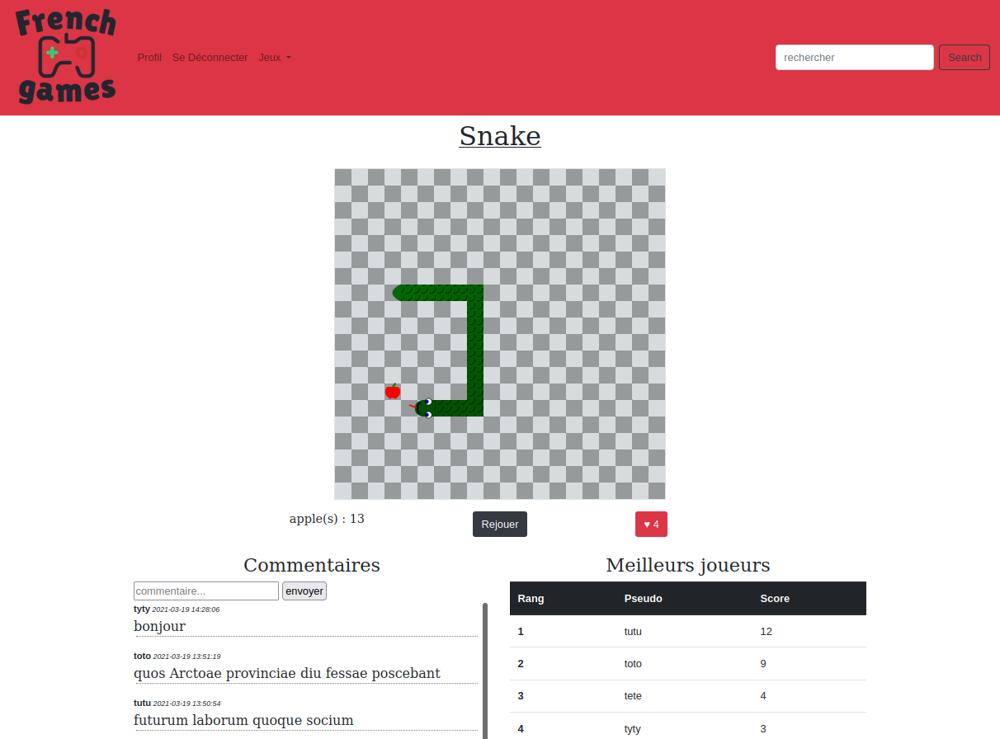
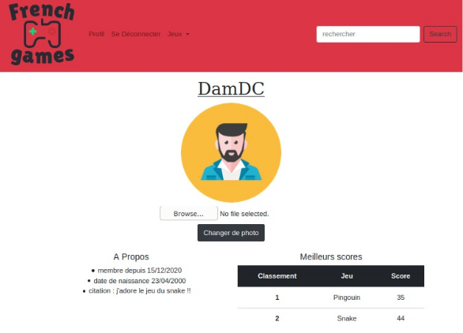

# French Games

## Academic project

The purpose of this academic project was to learn **web development**. I had a few classes so I learned a lot by myself front-end and back-end development.

**French Games** is a website where you can play several simple games on your web browser. Players can like and comment the games and best scores of each game are recorded.  

Snake game

Player can personalize their own profile and see others players profiles.

Player profil

## Knowledge

For this project I discovered and learned the library **Bootstrap** that I used to build the front end.

I also used **AJAX** for the first time in order to update the page content when the database is updated without having to refresh the page.

It is my first responsible website that can be used on any platform.
